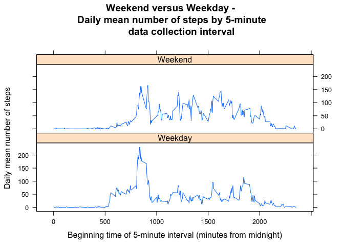

# Reproducible Research: Peer Assessment 1

This document describes the data acquisition, processing, analysis, and results 
for the Peer Assigment Project 1 for the Coursera Reproducibe Research Course.

## Loading and preprocessing the data

The data file for this project is available in: 
[Github repository](http://github.com/rdpeng/RepData_PeerAssessment1).

The data file ("activity.csv") is in a zip archive in this repository. This 
repository was forked and a local RStudio project was created by cloning this repository.
Steps involved in extracting and pre-processing data:

1. **Extract data file from zip archive**


```r
    unzip("activity.zip")
```

2. **Read data file as dataframe "activ"**


```r
    activ <- read.csv("activity.csv")
```

3. **Description of activity file**

a. structure of the data file (activity):
        

```r
str(activ)
```

```
## 'data.frame':	17568 obs. of  3 variables:
##  $ steps   : int  NA NA NA NA NA NA NA NA NA NA ...
##  $ date    : Factor w/ 61 levels "2012-10-01","2012-10-02",..: 1 1 1 1 1 1 1 1 1 1 ...
##  $ interval: int  0 5 10 15 20 25 30 35 40 45 ...
```

b. data file summary  (activity):
    

```r
summary(activ)
```

```
##      steps               date          interval   
##  Min.   :  0.0   2012-10-01:  288   Min.   :   0  
##  1st Qu.:  0.0   2012-10-02:  288   1st Qu.: 589  
##  Median :  0.0   2012-10-03:  288   Median :1178  
##  Mean   : 37.4   2012-10-04:  288   Mean   :1178  
##  3rd Qu.: 12.0   2012-10-05:  288   3rd Qu.:1766  
##  Max.   :806.0   2012-10-06:  288   Max.   :2355  
##  NA's   :2304    (Other)   :15840
```

c. Number of records: 17568

d. Missing data:


```r
miss <- vector()
for (i in 1:ncol(activ)){
    miss <- rbind(miss,paste(colnames(activ)[i], ": ", sum(is.na(activ[,i])), 
        " missing values   ",sep=""))
}
as.data.frame(miss)
```

                             V1
1 steps: 2304 missing values   
2     date: 0 missing values   
3 interval: 0 missing values   

e. Dates of data collection:

A personal activity monitoring device worn by a single, anonymous volunteer 
participant collected data at 288 5 minute 
intervals through out 61
days during the months of October and November, 2012. Dates of data collection
were:  
2012-10-01, 2012-10-02, 2012-10-03, 2012-10-04, 2012-10-05, 2012-10-06, 2012-10-07, 2012-10-08, 2012-10-09, 2012-10-10, 2012-10-11, 2012-10-12, 2012-10-13, 2012-10-14, 2012-10-15, 2012-10-16, 2012-10-17, 2012-10-18, 2012-10-19, 2012-10-20, 2012-10-21, 2012-10-22, 2012-10-23, 2012-10-24, 2012-10-25, 2012-10-26, 2012-10-27, 2012-10-28, 2012-10-29, 2012-10-30, 2012-10-31, 2012-11-01, 2012-11-02, 2012-11-03, 2012-11-04, 2012-11-05, 2012-11-06, 2012-11-07, 2012-11-08, 2012-11-09, 2012-11-10, 2012-11-11, 2012-11-12, 2012-11-13, 2012-11-14, 2012-11-15, 2012-11-16, 2012-11-17, 2012-11-18, 2012-11-19, 2012-11-20, 2012-11-21, 2012-11-22, 2012-11-23, 2012-11-24, 2012-11-25, 2012-11-26, 2012-11-27, 2012-11-28, 2012-11-29, 2012-11-30


## What is mean total number of steps taken per day?


```r
    library(dplyr)
```

```
## 
## Attaching package: 'dplyr'
## 
## The following objects are masked from 'package:stats':
## 
##     filter, lag
## 
## The following objects are masked from 'package:base':
## 
##     intersect, setdiff, setequal, union
```

```r
    dsum <- group_by(activ,date) %>%
    summarise(total_steps = sum(steps))
```

The mean total number of steps per day was 
10766 steps, 
and the median was 
10765 steps.  

The distribution of the total number of steps per day across the
61 days of data collection is presented in the following figure.  


```r
hist(dsum$total_steps, breaks=10, xlab= "Daily Total Steps", main="Raw distribution of total steps across 61 days \n from 2012-10-01 - 2012-11-30")
```

 


## What is the average daily activity pattern?


```r
dave <- group_by(activ,interval) %>%
    summarise(mean_steps = mean(steps, na.rm=TRUE))
```

Means (across days) were calculated for each 5-minute data collection interval. 
The interval beginning at 
0835 
had the largest mean number of steps 
(206.17).   
The following figure shows daily average number of steps by data collection interval.
  
  

```r
plot(mean_steps ~ interval, data = dave, type="l", 
     ylab="Daily mean number of steps",
     xlab="Beginning time of 5-minute interval (minutes from midnight)",
     main="Daily mean number of steps by 5-minute data collection interval")
```

 


## Imputing missing values
There were 15264 cases with complete data and 
2304 that had missing data values,
all for the 'steps' variable. Missing values were replaced with the mean 
(across days) of non-missing values for the interval. 


```r
activimp <- merge(activ,dave, by="interval")
activimp$steps <- ifelse(is.na(activimp$steps),activimp$mean_steps,activimp$steps)
activimp <- activimp[order(activimp$date,activimp$interval),]
activimp <- activimp[,c("steps","date","interval","mean_steps")]

dsumimp <- group_by(activimp,date) %>%
    summarise(total_steps = sum(steps))
```

The mean total number of steps per day was 
10766 steps, 
and the median was 
10766 steps.  

The distribution of the total number of steps per day across the
61 days of data collection in the dataset with imputed
missing values is presented in the following figure.  


```r
hist(dsumimp$total_steps, breaks=10, xlab= "Daily Total Steps", main="Raw distribution of total steps across 61 days \n from 2012-10-01 - 2012-11-30")
```

 

Imputing missing values did not change the estimated daily mean and median total 
steps. However, the distribution of values did change, with more days falling in the center of the distribution.


## Are there differences in activity patterns between weekdays and weekends?

A variable was created to code dates as weekdays versus weekends.


```r
activimp$day <- weekdays(as.Date(activimp$date))
activimp$day_type <- as.factor(ifelse(activimp$day %in% c("Saturday","Sunday"),"Weekend","Weekday"))
```

The following figure compares daily mean number of steps by time interval for weekdays versus weekend days. Weekends appear to have lower activity levels early in the day and higher activity levels later in the day.


```r
daveimp <- group_by(activimp,interval, day_type) %>%
    summarise(mean_steps = mean(steps, na.rm=TRUE))

library(lattice)

xyplot(mean_steps ~ interval | day_type, data=daveimp, type="l",
       main="Weekend versus Weekday - \n Daily mean number of steps by 5-minute 
       data collection interval",
       ylab="Daily mean number of steps",
       xlab="Beginning time of 5-minute interval (minutes from midnight)",
       layout=c(1,2))
```

 
